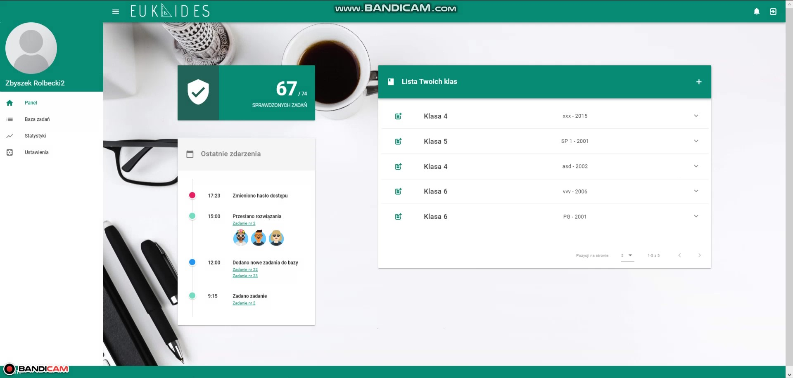
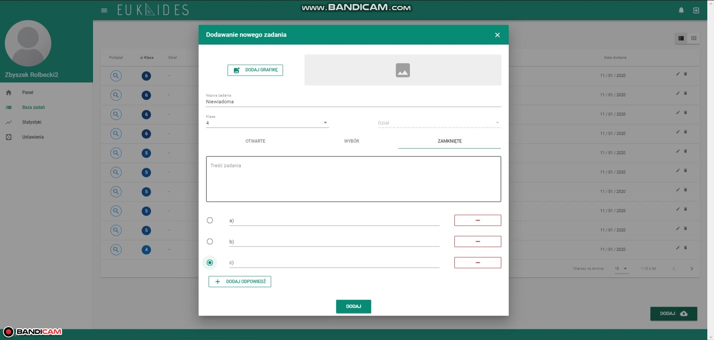

## 📝 About project

The aim of this project is to prepare the prototype of interscholastic platform for learning
maths. We have created an interactive project of user interface. The main
part of the project is the internet platform. It consists of two integrated applications - a
server with a database and web application. It contains examples of various tasks for
students along with a test base of students in particular classes.

**_This repository contains only web application_**


## 👀 Application preview 

▶️▶️ [Watch video](https://vimeo.com/646578194) ◀️◀️ 




## API documentation

* Swagger specification: [swagger.json](./api/swagger.json) *(automatically generated by [springfox](https://github.com/springfox/springfox))*
* [PDF version](./api/euklides-api-doc.pdf)


## Build Setup

``` bash
# install dependencies
$ npm install # Or yarn install

# serve with hot reload at localhost:3000
$ npm run dev

# generate api client from swagger spec 
$ node api/generator.js
```

## Links

- Framework https://nuxtjs.org/guide
- Routing: https://nuxtjs.org/guide/routing/
- Decorators: https://github.com/nuxt-community/nuxt-property-decorator
- HTTP Client: https://axios.nuxtjs.org
- UI Library: https://vuetifyjs.com/en/getting-started/quick-start
- Type Safe Vuex Module https://github.com/michaelolof/vuex-class-component
- Swagger Code Generator https://github.com/michalzaq12/swagger-taxos-codegen
